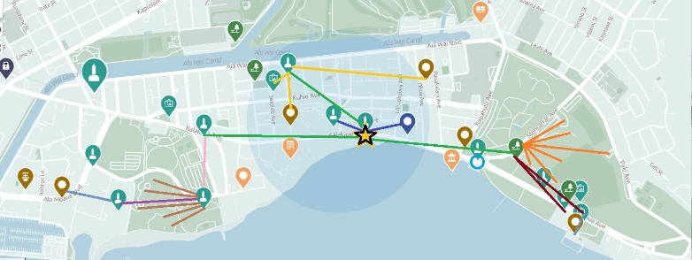

# Secret of the Menehune: Complete Quest Document

##Indigenous Land Acknowledgement

I am fortunate to call Hawaii home, but I recognize that these islands are not my own. They are the ancestral lands of a sovereign, independent indigenous kingdom. In 1893, this kingdom was overthrown with the support of the U.S. government and American business interests. This interference paved the way for the annexation of the kingdom by 1898, during which the U.S. government "ceded" these lands without the consent of the Native Hawaiian people, known as Kānaka Maoli.

Since then, these lands have been exploited for their resources and have undergone irreversible changes in the name of violence, power, and destruction. Ecological atrocities have occurred here on scales beyond human comprehension, leaving indelible marks on the land, as exemplified by the bombings of Kahoʻolawe. Despite these scars, Hawaii remains one of the most beautiful places on earth.

For those who wish to delve deeper into this history and its ongoing impact, I encourage you to explore resources such as the Office of Hawaiian Affairs. You can find more information at [Office of Hawaiian Affairs](https://www.oha.org/).

Mahalo,
Constantine Peros

## Introduction

Embark on "Secret of the Menehune," a captivating AR quest that is not only a game but a showcase of the ARDK Creator Toolkit, a tool I personally developed to revolutionize AR experiences in Unity. This toolkit, demonstrates the innovative use of Niantic's ARDK and Maps, enabling rapid and efficient creation of complex AR quests.

Over the course of about a day, I utilized the toolkit to set up the fundamental game interactions and quest system. This efficiency allowed me to dedicate the majority of my time to developing the unique elements that define an engaging game: immersive storytelling, vibrant assets, and intricate models, all underpinned by a rich Hawaiian cultural theme.

At its core, the game leverages Niantic's semantic segmentation technology, allowing players to collect 'mana' or spiritual energy from their environment. This energy is then used to heal corrupted wildlife, mirroring the game's emphasis on environmental stewardship, awareness of invasive species, and the preservation of Hawaiian language and culture.

"Secret of the Menehune" stands as a testament to the creative potential unleashed by the ARDK Creator Toolkit. It exemplifies how developers can quickly build immersive AR experiences, focusing their creativity on what makes their games distinct and memorable. This project is a strategic entry in a contest that could significantly broaden Niantic's reach in the AR development community, showcasing the innovative application of AR in both educational and entertainment contexts.

Join us in this enchanting exploration of Hawaii's cultural and natural beauty, where the boundaries between technology, education, and tradition are seamlessly blended for an unforgettable experience.

## Map Layout:

## Main Quest Chain: Menehune-Centric Structure:

#### 1. Nui - Aloha Waters
- Location: Duke Kahanamoku Statue
- Quest 1: Map Quest (Initial Quest)
  - Objective: Retrieve the Materials for Menehune map for navigating Niantic maps.
  - Task Locations: 
    - Dolphins Sculpture
    - 3d Cheeseburger in Paradise
- Quest 2: Find Three Others
  - Objective: Locate three other Menehune in different realms.
  - Find 3 Specific Realms and Guardians:
    - Sacred Gardens (Guardian: Lanihuli)
    - Nā Kūʻai Square (Guardian: Makamae)
    - Royal Grounds (Guardian: Kānehoa)
  - Task Locations: 
    - Aloha Girl in Kapiolani Park
    - White Sands Tiki
    - Rooftop Guitar Collection at the Hard Rock Cafe
#### 2. Lanihuli - Sacred Garden
- Location: Aloha Girl in Kapiolani Park
- Quest 1: Old Stone Fountain
  - Objective: Uncover the mystery of the Old Stone Fountain.
    - Task Locations: 
    - Kāhi Hāliʻa Aloha
- Quest 2: Monkey Business
  - Objective: Address the chaos caused by monkeys near the Honolulu Zoo.
- Quest 3: Find Two Others
  - Objective: Locate Moanaiki outside of the Waikiki Aquarium and Kaiāulu near the War Memorial.
  - Task Locations:
    - Hypnotizing Rock in Front of Waikiki Aquarium
    - Roll of Honor
#### 3. Kaiāulu - Lēʻahi Domain
- Location: Roll of Honor, War Memorial
- Quest: Calm the Lurker
  - Objective: Pacify a mysterious entity causing unrest.
  - Task Locations: 
    - Waikiki Natatorium
#### 4. Moanaiki - Lēʻahi Domain 
- Location: Hypnotizing Rock near Waikiki Aquarium
- Quest: Save Moanaiki from Nene and Hawk
  - Objective: Protect Moanaiki from the cursed creatures.
#### 5. Makamae - Nā Kūʻai Square
- Location: White Sands Tiki
- Quest: Collect three items for Makamae.
  - Task Locations: 
    - Tiki Mural of Tapas Waikiki Alley
    - Waikiki Banyan Lobby
    - Paul Whitney Trousdale
#### 6. Kānehoa - Royal Grounds
- Location: Rooftop Guitar Collection at the Hard Rock Cafe
- Quest: Urgent Delivery
  - Objective: Deliver an important item to Kānehoa.
  - Task Location: 
    - US Prefab Pill Box
#### 7. Pohaku - Royal Grounds 
- Location: US Prefab Pill Box
- Quest 1: Find 3 Kittens
- Quest 2: King's Quest
  - Task Locations: 
    - Menehune King
#### 8. King Kalolani - Royal Grounds
- Location: Menehune King Statue
- Quest: A Navigator Lost
  - Objective: Assist in finding a lost navigator.
  - Task Locations: 
        - Ilikai Hotel Sign
#### 9. Hōkūleʻa - Royal Grounds 
- Location: Ilikai Hotel Sign
   1. *Note*: No quests currently assigned.
#### 10. Ahi - Aloha Waters (Bonus Quest)
- Location: Surfer On Wave
- Quest: Save Ahi from Monk Seal
  - Objective: Rescue Ahi from a perilous situation.
  - Task Locations: 
        - Surfer On Wave

## Game Mechanics:

### Mana Lens

#### Introduction to Mana Lens

- Primary Tool: Given by Nui at the start of the game.
- Functions: Has 'Extract Mode', 'Seek Mode', and 'Off'.

#### Extract Mode

- Functionality: Utilizes Niantic's semantic segmentation to extract essences from the real world.
- Essence Collection: Players can gather different essences based on their environment (e.g., Honua, Lani, Wai).
- Essence Pouch: Collected essences are stored in a virtual pouch for later use.
- Usage in Healing: Essences are used to heal cursed animal spirits encountered during quests.
- Mechanics of Healing:
  - Use three essences at a time from the pouch.
  - Each essence can have a positive or negative effect on the cursed entity.
  - Certain combinations of essences can be more effective or harmful.
  - Each creature has unique susceptibilities; players need to decipher clues from dialogues to identify effective essences.

#### Seek Mode

Functionality: An alternative way to locate and interact with cursed entities. Realms Division: Waikiki is divided into five realms, each with distinct entities. Entity Appearance:

- Entities appear based on the player's tapped essence in a specific realm.
- Different animals have varying scarcity levels depending on the essence and realm.

Quest Completion: Provides players with alternative methods to complete quests if they cannot physically reach certain locations.

Scarcity Levels: Example - Kitties may commonly appear in foliage in the Royal Grounds when a specific essence is activated.

## Menehune Map and Niantic Maps Integration

#### Menehune Map: The Core Navigation Tool

- Purpose: Acts as the primary guide for players in the game.
- Functionality: Reveals the five distinct realms of Waikiki, each with unique characteristics and quests.
- Interactivity: Players can interact with the map to discover new locations and track their progress through various quests.

#### Niantic Maps: Real-World Integration

- Integration with Menehune Map: Niantic Maps underpins the Menehune Map, providing real-world geographical data and location services.
- Realms Outline:
  - Each of the five realms is distinctly outlined on the map.
  - The realms are differentiated by specific thematic elements, environmental features, and the type of quests available.

#### Points of Interest (POIs)

- Identification: Key locations, such as where Menehune are found or where certain quests begin, are marked as POIs on the map.
- Real-World Anchoring: POIs are anchored to real-world locations in Waikiki, encouraging exploration and physical movement.

#### Gameplay Enhancement

- Strategic Exploration: Players use the map to plan their exploration strategies, choosing which realms to visit based on their current quests and objectives.

#### Educational and Cultural Integration

- Cultural Landmarks: The map can help highlight culturally significant locations, providing educational insights into Hawaiian history and culture.
- Environmental Awareness: Emphasizes the importance of the natural environment and its preservation, in line with the game's themes.

## Cursed Creature Purification Mechanic

#### Overview

- Purpose: Players encounter cursed creatures during quests, which they must heal using essences.
- Essence Pouch: A virtual pouch where players store essences collected through the Mana Lens.

#### Battle Mechanics

- Initiation: Encounters with cursed creatures start a purification 'battle'.
- Essence Use: Players select three essences from their pouch to attempt healing.
- Combination Effects:
  - Each essence has unique properties; some may heal while others may aggravate the curse.
  - Players must choose combinations wisely based on clues and creature characteristics.
  - Certain combinations have multiplier effects, either amplifying healing or worsening the curse.

#### Universal Healing Essence: Pono

- Special Essence: Pono is a unique essence that can partially heal any entity (10pts), offering a universal healing power.
- Healing Power: It consistently heals 10 points of any creature's curse, regardless of its nature.
- Often given as a gift for completing quests

#### Battle Strategy

- Clue Analysis: Players are encouraged to look for hints in dialogues and creature descriptions to identify weaknesses.
- Trial and Error: Experimentation with different essence combinations is key to understanding the most effective healing strategies.

#### Rewards for Successful Purification

- Fun Fact: After purifying a creature, players receive an educational snippet about the creature or related Hawaiian culture.
- Item Acquisition: Each purified creature drops a unique item, adding to the player's collection and often aiding in further quests.

#### Gameplay Impact

- Educational Value: The fun facts serve to educate players about Hawaiian wildlife and culture.
- Progression: Successfully healing creatures is essential for quest advancement and unlocking new areas or challenges.

#### Example Scenario

Creature Encounter: Player encounters 'Hexed He'e', a cursed reef squid. Battle Strategy: Player selects a combination of essences based on the squid's characteristics and hints received earlier.

Outcome: Successful purification rewards the player with a fun fact about the Hawaiian bobtail squid and a special item related to the creature.

## Game Script: "Secret of the Menehune"

### Scene 1: Introduction at Duke Kahanamoku Statue

Nui: (Greeting the player, looking sad) "Our aina cries, overwhelmed by invasive species and a deepening curse. Once, we Menehune kept harmony, but now... it's beyond us. Take this Mana Lens, your kuleana. See the unseen, restore what's lost, bring back balance to our lands."

(Player taps above Nui's head to acquire the Mana Lens.)

Item Notification: "Mana Lens Acquired! Harness the world's energies. Capture essences like lani (sky), honua (ground), wai (water), and more. Store them in your mana pouch to learn and restore balance."

Nui: "Bring me the squid's ink and the turtle's compass, and I'll craft a map to guide your quest."

(Nui gives rotating hints for the duration of the initial quest.) Dialog upon a Cursed Creature Encounter

Cursed Creature Notification: "A Cursed Creature! Choose wisely from your Essence Pouch to restore the creature's harmony. Some essences soothe the curse, while others may worsen it."

### Scene 2: Map Quest - The Turtle and the Squid

(Player finds 'Ea Enigma' and 'Hexed He'e' at specified locations.)

'Ea Enigma: (Description) "A green sea turtle known as ʻea in Hawaiian, now cloaked in mysterious energies. It glides through the water leaving a trail of mystic fog in its wake."

Did You Know?: "The main predators of the Honu are large sharks. But human involvement is a close second, please respect all wildlife found in our local waters."

Drop Item: "Honu's Guiding Compass. An ornate compass, embodies the sea turtle's remarkable navigation skills."

Hexed He'e: (Description) "A reef squid, twisted into a vessel of deep-sea sorcery, disturbing the depths."

Did You Know?: "The Hawaiian bobtail squid has an 'invisibility cloak,' thanks to a symbiotic relationship with bioluminescent bacteria."

Drop Item: "He'e's Ink Sac. A mysterious ink sac from a Hawaiian Bobtail Squid. It's filled with ink that holds magical properties."

(Quest completes and the player returns to Nui.)

### Scene 3: Nui - Map Quest Completion

Nui: "Now you can see the 5 realms on your map: Aloha Waters, Nā Kūʻai Square's market life, Sacred Gardens' nature whispers, Royal Grounds' ancestral echoes, and Le'ahi Domain's fiery challenge."

Item Notification: "You've received the Menehune Map! Your map will now show key locations and detailed layouts of each region, guiding your adventure with menehune wisdom."

(Nui gives three Essence of Pono and assigns the quest to find three other Menehune.)

Nui: "Seek the guardians in Waikiki. Find 3 others, one lies west toward the Royal Grounds, another east in the Sacred Gardens, and the third in the heart of Nā Kūʻai Square. Their locations are marked on your map."

(Nui provides rotating dialog for three prompts: Sacred Gardens, Nā Kūʻai Square, and Royal Grounds.)

### Scene 4: Lanihuli - Sacred Gardens

Lanihuli: (Welcoming the player) "E komo mai. Aloha, I'm Lanihuli of the Sacred Gardens. Our land remembers every step and touch. Let's tread lightly, listening to nature's whispers, and heal the traces we leave behind."

Lanihuli: (Regarding the Old Stone Fountain) "The old stone fountain by the zoo is troubled by cursed beings. Can you help bring peace back there? Your actions will help heal the land's scars."

(Repeating message: Kōkua, providing clues for lizard and chicken purification.)

(Player encounters and purifies Moʻo Mischief and Moa Marauder, receiving items and fun facts.)

Lanihuli: (Upon quest completion) "Mahalo! Your gentle touch has soothed the spirits of the lizard and chicken, restoring peace to this sacred place. The Sacred Gardens breathe easier thanks to your efforts."

### Scene 5: Lanihuli's Monkey Business Quest

Lanihuli: "The monkeys, once residents of the Honolulu Zoo, now roam free in Queen Kapiolani Park, their spirits clouded by a strange malaise. Their joyous energy, once a delight within the zoo's walls, is vital to the harmony of this place. I ask you to seek out and heal at least five of these spirited escapees. While there are more who might need your help, healing five will significantly restore balance."

(Repeating Hint: Familiar Friends)

Lanihuli: "They're drawn to the sustenance of food and the presence of people, finding comfort in these familiar elements. Likewise, the sturdy embrace of a tree trunk, coupled with the warmth of human interaction, speaks deeply to their nature. Keep these affinities in mind for your quest."

(Player embarks on the Monkey Business quest. In the Sacred Gardens and tree trunks, they find and heal monkeys.)

Keko Chaos: (Description) "Escaped monkeys, their mischief magnified into mayhem, turning the treetops into turmoil."

Did You Know?: "Escaped monkeys, their mischief magnified into mayhem, turning the treetops into turmoil."

Item Drop: "Monkey's Mirthful Bead. A bead that brings laughter and happiness." (After finding and healing three monkeys, the player returns to Lanihuli.)

Lanihuli: "Mahalo! Your gentle touch has soothed the spirits of these monkeys, bringing joy back to the park. The Sacred Gardens once again resonate with their playful energy. Your efforts have woven new strands of harmony across our lands."

(Lanihuli then directs the player to find the guardians by the Natatorium and Aquarium.)

Lanihuli: "Next up, find the guardians by the Natatorium and Aquarium. Good thing there isn't a nearby Planetarium, or you'd probably have to visit there too! Seems like our guardians have a thing for a 'RIUM' and Coke."

### Scene 6: Moanaiki's Quest at the Aquarium

(Player locates Moanaiki near the hypnotizing rock at Waikiki Aquarium.)

Moanaiki: (Surrounded by creatures) "As you can see, I'm in a bit of a bind here. These creatures, once peaceful, now thrash in confusion and fear, tainted by a strange force. Can you help restore them to their true nature?"

(Player is assigned the Nene and the Hawk quest.)

### Scene 7: The Nene and the Hawk Quest

(Player locates Io Ire and Nene Nefarious, purifying them and receiving items and fun facts.)

Io Ire: (Description) "The Hawaiian hawk, its majestic flight now a dive through despair, casting shadows over the land."

Did You Know?: "The 'io, or Hawaiian hawk, is the only broad-winged hawk in Hawai'i. 'Io are considered 'aumākua, or family gods, by Native Hawaiians."

Item Drop: "Hawk's Eye Agate. A gem that mirrors the keen sight of a hawk, offering clarity and insight. Its deep blues and grays symbolize wisdom and protection."

Nene Nefarious: (Description) "The gentle Nene, transformed into a harbinger of havoc, its calls now a portent of chaos."

Did You Know?: "The nene goose descended from Canadian geese and is now the rarest goose in the world."

Item Drop: "Nene's Feather of Flight. A feather of the Nene goose, representing freedom and the spirit of Hawaii."

(Upon completing the quest, the player returns to Moanaiki.)

Moanaiki: "Mahalo nui loa for your kokua! Your actions have calmed the storm in the hearts of these creatures, restoring peace."

### Scene 8: Kaiāulu's Quest at the War Memorial

(Player finds Kaiāulu at the Roll of Honor, War Memorial.)

Kaiāulu: "I'm Kaiāulu of the Natatorium, where we honor bravery and sacrifice. Our deeds shape our legacy, much like waves shape the shore. Let's remember those who served with courage."

(Kaiāulu assigns the Calm the Lele Lurker quest.)

Kaiāulu: "A troubling spirit has descended from Le'ahi to our memorial, threatening to corrupt the memories of our fallen heroes. We must act to preserve their honor. Calm this malevolent presence, and safeguard the sanctity of their memory."

(Player locates and purifies the Lele Lurker, receiving items and fun facts.) Lele Lurker:

A malevolent entity that clings to the dirt of Diamond Head, its presence a blight upon the earth.

Did you know? The Hawaiian name for Diamond Head is Lē'ahi, which translates to “forehead [of the] ahi [fish].”

Item Drop:

Lēʻahi's Deception Gem

A sparkling crystal mistaken for a diamond by early sailors. It's not a true diamond, but its radiant beauty is undeniable.

(Player returns to Kaiāulu with purified Lele Lurker.)

Kaiāulu: "Mahalo nui loa! You have much kindness, friend. The memories of our heroes are now free from corruption, their spirits at peace thanks to your efforts. Your actions honor not only them but all of us."

### Scene 9: Makamae's Quest in Nā Kūʻai Square

(Player finds Makamae at the White Sands Waikiki entrance)

Makamae: "Welcome to Nā Kūʻai Square! I am Makamae, guardian of this bustling center, where the spirit of 'ohana weaves through every street. Lately a dissonance disrupts our harmony. Can you find the Woodroach's Hibiscus, Mongoose's Marble, and Tilapia's Scale? They're key to restoring balance."

(Makamae gives rotating location hints for each item)

(Player collects items by purifying creatures)

Tilapia Trouble: "Once common tilapia now thrash with turbulent energy."

Fun Fact: Tilapia species are now established in Hawaiian waters after introduction. Item: Tilapia Scale

Alāmona of Anarchy: "A mongoose stalking the streets, its playful nature twisted."Fun Fact: Mongooses were introduced to Hawaiian islands to control rats.

Item: Mongoose Marble

Evil 'Uli: "A cockroach spreading corruption."

Fun Fact: Most Hawaiian cockroaches are introduced species. Item: Woodroach Hibiscus

(Player returns items to Makamae)

Makamae: "Mahalo! Your efforts have brought peace back to Nā Kūʻai Square. The market thrives when harmony reigns."

### Scene 10: Kānehoa's Quest in the Royal Grounds

(Kānehoa greets player at the Hard Rock Cafe Rooftop)

Kānehoa: "Aloha! I'm Kānehoa. These grounds hold stories and laughter. Can you deliver an urgent message to the Pill Box for me?"

(Player finds Pohaku at the Pill Box)

Pohaku: "Conflict's deep scars linger. Can you heal 3 corrupted kitten spirits in Fort De Russy Park?"

(Player heals 3 Popoki Peril cats)

Fun Fact: Feral cats threaten native wildlife.

Item: Whisker of Wanderlust

(Player returns to Pohaku)

Pohaku: "The spirits of these little ones are now at peace. Seek the Menehune King!"

### Scene 11: King's Quest

(Player follows map to find King Kalolani)

Kalolani: "You have shown great kuleana, but my Royal Navigator is lost! Can you find Hōkūleʻa at the Ilikai Hotel?"

(Player locates Hōkūleʻa)

Hōkūleʻa: "I was caught in a whirlpool of negative mana. Thanks to you, I'm back on course."

(Player returns to King Kalolani)

Kalolani: "Winds of fate shift, but your efforts returned our Navigator! Our path to balance is clearer."

### Scene 12: Bonus Quest - Save Ahi

(Side quest - Player finds Ahi ensnared at the Surfer statue) Ahi: "A crafty spirit has me ensnared. Can you free me?" (Player locates and frees the Monk Seal)

Monk Seal: "Once peaceful, now disturbing the calm of the seas."

Ahi: "You have great strength and kindness. May your journey continue, blessed by the spirit of aloha!"

## Appendices

### Glossary of Definitions and Hawaiian Terms

#### Menehune Names, Descriptions, and Translations:

##### Nui

- Description: The first Menehune encountered, gives the Mana Lens.
- Translation: "Large" or "important."

##### Lanihuli

- Description: Guardian of the Sacred Gardens.
- Translation: "Heavenly turn" or "heavenly change."

##### Makamae

- Description: Guardian of Nā Kūʻai Square.
- Translation: "Precious" or "beloved."

##### Kānehoa

- Description: Guardian at the Royal Grounds.
- Translation: "Breathing man" or "man's breath."

##### Kaiāulu

- Description: Located at the Roll of Honor, War Memorial.
- Translation: "Sea breeze."

##### Moanaiki

- Description: Near the Hypnotizing Rock by Waikiki Aquarium.
- Translation: "Small ocean" or "small expanse of sea."

##### Pohaku

- Description: At the US Prefab Pill Box.
- Translation: "Stone" or "rock."

##### King Kalolani

- Description: The Menehune King, at the Menehune King Statue.
- Translation: "Kalolani" is a compound of "Kalo," a significant plant in Hawaiian culture, and "Lani," meaning "heaven" or "sky."

##### Hōkūleʻa

- Description: At the Ilikai Hotel Sign.
- Translation: "Star of gladness." Named after the famous Hawaiian voyaging canoe, symbolizing exploration and navigation.

##### Ahi

- Description: Near the Surfer On Wave statue.
- Translation: "Fire" or "tuna" (specifically yellowfin tuna).

#### Cursed Animal Names

##### Hexed He'e: The reef squid cursed with deep-sea sorcery.

- Translation: "He'e" means "octopus" or "squid" in Hawaiian.
- Cultural Context: In Hawaiian mythology, the octopus or squid is sometimes associated with the supernatural and the mysterious aspects of the ocean.

##### 'Ea Enigma: The mystically cloaked green sea turtle.

- Translation: "'Ea" can refer to the Hawaiian green sea turtle, also known as "Honu."
- Cultural Context: The green sea turtle is a symbol of good luck, endurance, and long life in Hawaiian culture.

##### Moʻo Mischief: The lizard causing pandemonium.

- Translation: "Moʻo" means "lizard" in Hawaiian.
- Cultural Context: Moʻo are often depicted in Hawaiian mythology as guardian spirits, sometimes with shapeshifting abilities.

##### Moa Marauder: The once-vigilant bird turned chaotic.

- Translation: "Moa" means "chicken" or "fowl" in Hawaiian.
- Cultural Context: Chickens or moa are common in Hawaiian folklore, often symbolizing watchfulness and alertness.

##### Keko Chaos: The mischievous monkeys in the treetops.

- Translation: "Keko" is a term used for monkeys.
- Cultural Context: Monkeys, while not native to Hawaii. In Waikiki, the sounds of monkeys, originating from the Honolulu Zoo, contribute to the unique auditory landscape of the area, blending with the natural and urban sounds of this region.

##### Io Ire: The Hawaiian hawk diving through despair.

- Translation: "Io" is the Hawaiian hawk.
- Cultural Context: The io is considered sacred in Hawaiian culture and is a symbol of royalty and power.

##### Nene Nefarious: The Nene goose, a harbinger of havoc.

- Translation: "Nene" is the Hawaiian goose.
- Cultural Context: The nene is Hawaii's state bird and is revered in Hawaiian culture, often symbolizing adaptability and resilience.

##### Alāmona of Anarchy: The mongoose stalking the streets.

- Translation: "Alāmona" is used here to represent the mongoose.
- Cultural Context: The mongoose is an invasive species in Hawaii, known for its impact on native birds and ecosystems.

##### Evil 'Uli: The cockroach spreading corruption.

- Translation: "'Uli" does not directly translate to cockroach, but darkness

##### Lele Lurker: The unknown entity at Diamond Head.

- Translation: "Lele" means "to fly" or "to leap" in Hawaiian.
- Cultural Context: This term may imply a creature that is elusive, agile, and possibly airborne, fitting for a mysterious entity.

##### Pōpoki Peril: The stray cat turned harbinger of misfortune.

- Translation: "Pōpoki" means "cat" in Hawaiian.
- Cultural Context: Cats are not native to Hawaii and, like the mongoose, have impacted native wildlife. They are often associated with independence and mystery.

##### Maluhia Mauler: The monk seal wrapped in dark sorcery.

- Translation: "Maluhia" means "peace" or "tranquility" in Hawaiian.
- Cultural Context: The Hawaiian monk seal is a critically endangered species and is deeply respected in Hawaiian culture, often seen as a symbol of conservation and the need to protect natural resources.

#### Hawaiian Terms in Dialogue

- Aloha: A Hawaiian word used when greeting or parting from someone. It also means love, affection, peace, compassion, and mercy.
- Aloha mai kākou: Greetings to all of us/welcome to us all.
- E komo mai: Welcome, come in.
- Aina: Land, earth.
- Mana: Spiritual energy or power.
- Kuleana: Responsibility.
- Lani: Sky.
- Honua: Ground, earth.
- Wai: Water.
- Mahalo: Thank you.
- Kōkua: Help, assistance.
- Kalo: is the Hawaiian term for taro, a plant that is of great cultural, historical, and culinary importance in Hawaii.
- Ho'omaika'i 'ana: Congratulations or well done.
- Maika'i loa: Very good/excellent.
- 'Aumākua: Family or ancestral gods, often embodied by specific animals or natural elements.
- Pōpoki: Cat.
- Menehune: Mythical dwarf-like beings in Hawaiian folklore, known as skilled craftsmen and builders.
- Duke Kahanamoku: Renowned Hawaiian surfer and Olympic swimmer, often referred to as the father of modern surfing.

#### Essences, Semantic Channels, and Hawaiian Translations:

##### Honua Hana Lima

- Semantic Channel: 'artificial\_ground'.
- Translation: "Honua" means "earth" or "ground," and "Hana Lima" implies "handiwork" or "craft."

##### Hale

- Semantic Channel: 'building'.
- Translation: "House" or "building."

##### Lepo

- Semantic Channel: 'dirt\_experimental'.
- Translation: "Dirt" or "soil."

##### Pua

- Semantic Channel: 'flower\_experimental'.
- Translation: "Flower."

##### La'au

- Semantic Channel: 'foliage'.
- Translation: "Tree" or "wood."

##### Mea'ai

- Semantic Channel: 'food\_experimental'.
- Translation: "Food."

##### Mau'u

- Semantic Channel: 'grass'.
- Translation: "Grass."

##### Honua

- Semantic Channel: 'ground'.
- Translation: "Earth" or "ground."

##### Ho'omaha

- Semantic Channel: 'loungeable\_experimental'.
- Translation: "Rest" or "relaxation."

##### Honua Maoli

- Semantic Channel: 'natural\_ground'.
- Translation: "Real" or "true earth/ground."

##### Kānaka

- Semantic Channel: 'person'.
- Translation: "Human" or "person." In a broader cultural context, it refers to the people, especially Native Hawaiians. Note the cultural significance: this term refers to people in general, not specifically to Native Hawaiians (Kanaka Maoli).

##### Holoholona Hoʻokipa

- Semantic Channel: 'pet\_experimental'.
- Translation: "Welcoming animal" or "pet." "Holoholona" means "animal," and "Hoʻokipa" implies "hospitality" or "welcoming."

##### Pono/Pono'ī

- Semantic Channel: Represents harmony.
- Translation: "Righteousness" or "excellence." "Pono'ī" refers to oneself, so it implies self-righteousness or personal excellence.

##### Kōneoneo

- Semantic Channel: 'sand\_experimental'.
- Translation: "Sand." "Kōneoneo" is a variation of "one," which means "sand." (Note: "One" was avoided to prevent confusion with the number one.)

##### Lani

- Semantic Channel: 'sky'.
- Translation: "Sky" or "heaven."

##### Hau

- Semantic Channel: 'snow\_experimental'.
- Translation: "Snow" or "dew."

##### Kumu La'au

- Semantic Channel: 'tree\_trunk\_experimental'.
- Translation: "Tree trunk." "Kumu" means "trunk" or "source," and "La'au" means "tree."

##### Kīwī

- Semantic Channel: 'tv\_experimental'.
- Translation: "TV." This is a transliteration of the English word "TV."

##### Ka'a

- Semantic Channel: 'vehicle\_experimental'.
- Translation: "Vehicle" or "car."

##### Wai

- Semantic Channel: 'water'.
- Translation: "Water."

#### Additional Cultural References

- Duke Kahanamoku: Renowned Hawaiian surfer and Olympic swimmer, often referred to as the father of modern surfing.
- Diamondhead Deception Gem: A fictional gem in the game, symbolizing the historical misconception about Diamond Head, a volcanic tuff cone on Oahu, Hawaii. The name "Diamond Head" originated in the 19th century when British sailors mistakenly believed the calcite crystals in the rock were diamonds. This gem in the game represents this historical misidentification.
- Lēʻahi (Diamond Head): The Hawaiian name for Diamond Head, a prominent landmark in Hawaii. The name Lēʻahi is derived from "lae" (browridge, promontory) and "ahi" (tuna), due to the landmark's resemblance to the shape of a tuna's dorsal fin. Lēʻahi holds significant cultural and historical importance in Hawaiian tradition.
